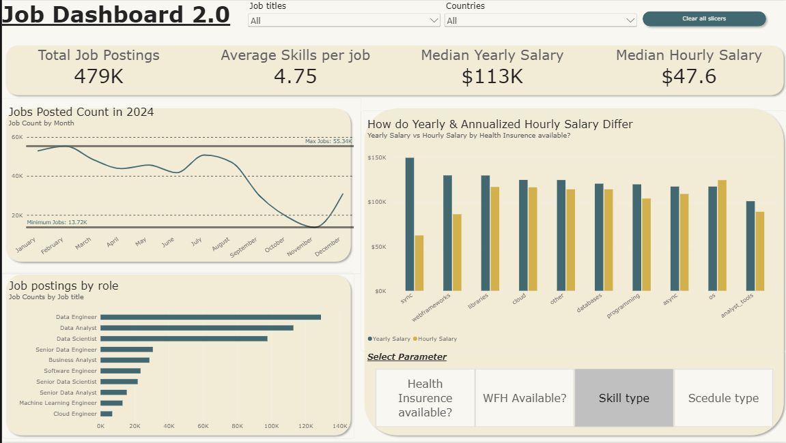
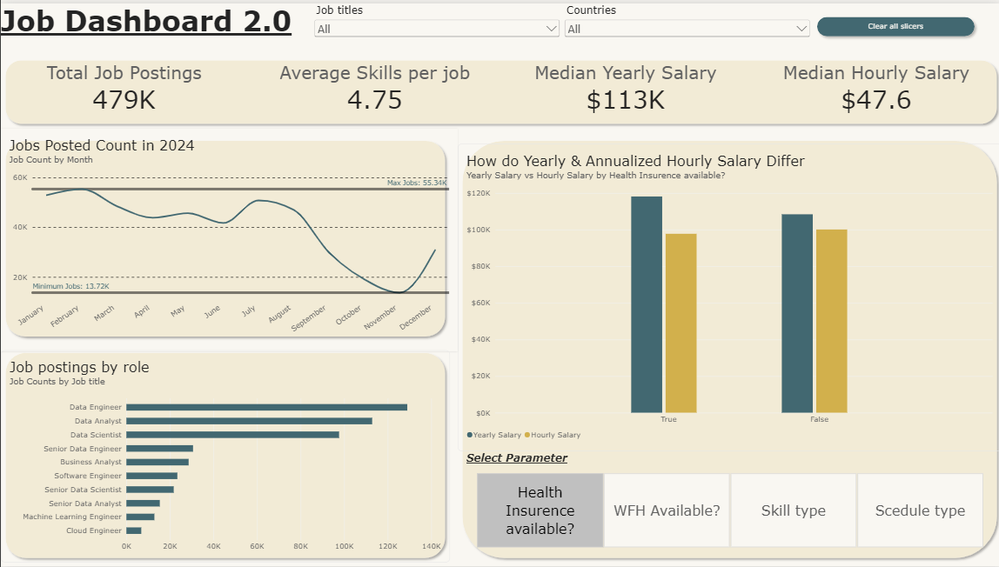

# 📊 Job Market Analytics Dashboard | Power BI

An interactive **Power BI dashboard** built using **479K+ job postings from 2024** to analyze job demand, salary trends, skill requirements, and employment characteristics.

## 📌 What This Dashboard Analyzes

- 📈 Job posting trends throughout 2024
- 💼 Job demand across different roles
- 💰 Median yearly and hourly salaries
- 🧮 Annualized hourly salary comparisons
- 🧠 Average skills required per job
- 🏠 Work-from-home availability
- 🏥 Health insurance availability
- 📅 Schedule/employment types
- 🌍 Job trends by country and job title

## 🛠️ Tools & Techniques

- **Power BI** – Dashboard & data visualization
- **DAX** – Measures and analytical calculations
- **Power Query** – Data cleaning & transformation
- **Data Modeling** – Structuring data for analysis
- **Dynamic Parameters** – Interactive analysis
- **Slicers & Filters** – User-driven exploration

## 📊 Key Metrics

| Metric | Value |
|---|---:|
| Job Postings | **479K+** |
| Average Skills per Job | **4.75** |
| Median Yearly Salary | **$113K** |
| Median Hourly Salary | **$47.6** |

## 💡 Key Feature

Hourly salaries were converted into an **annualized equivalent using 2,080 working hours/year**, allowing comparison with reported yearly salaries.

> Note: Annualized hourly salary is an estimated annual equivalent and does not represent actual annual earnings.

## 📚 Skills Strengthened

- Power BI Dashboard Development
- DAX & Measure Creation
- Power Query & Data Transformation
- Data Modeling
- Dynamic Parameters
- Data Visualization
- Exploratory Data Analysis
- Business Intelligence
- Data Storytelling

## 📸 Dashboard Preview




## 📂 Project Files

```text
Job-Market-Analytics-Dashboard/
│
├── Job Dashboard 2.0.pbix
├── README.md
└── images/
    └── s1.png,s2.png

    